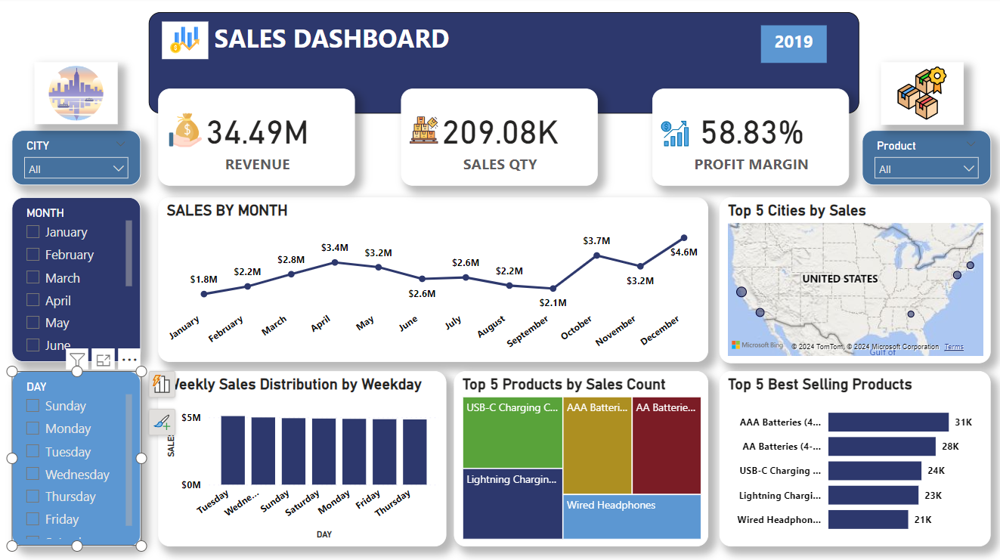

## MeriSKILL Internship Project 1: Sales Dashboard Insights

### Overview
The first project in the MeriSKILL internship involves analyzing and interpreting data from a comprehensive **Sales Dashboard** for the year 2019. The dashboard provides an in-depth look at key performance indicators (KPIs) that are crucial for making informed business decisions.

### Key Features of the Dashboard
1. **Revenue and Sales Quantity:** The dashboard displays a total revenue of **$34.4 million** and a total sales quantity of **209,000 units**.
2. **Profit Margin:** A high profit margin of **58.83%** is highlighted.
3. **Sales by Month:** A detailed line graph shows monthly sales from January to December.
4. **Weekly Sales Distribution:** A bar graph represents daily sales from Sunday to Friday.
5. **Top Products by Sales Count:** A colorful bar graph lists top-selling products, including **USB-C Charging Cable** and **AAA Batteries**.
6. **Top Cities by Sales:** A map pinpoints cities with the highest sales across the United States.

### Insights Derived
1. **High Profitability:** With a profit margin of 58.83%, strategies employed in pricing and cost management are effective.
2. **Peak Sales in December:** Monthly sales peaked in December at $4.6 million, indicating effective holiday season strategies or increased consumer spending during this period.
3. **Weekday Performance:** Higher sale volumes are noted during weekdays compared to weekends, suggesting a potential B2B customer base or consumer purchasing habits.
4. **Product Popularity:** USB-C Charging Cables are the most sold items, followed closely by different battery types, indicating high demand for electronic accessories.
5. **Geographical Spread:** Identifying top cities by sales can help focus marketing efforts and optimize supply chain logistics.

These insights will be instrumental in formulating strategies to enhance profitability, optimize product offerings, target marketing efforts effectively, and improve overall business performance during the course of this internship project at MeriSKILL.
